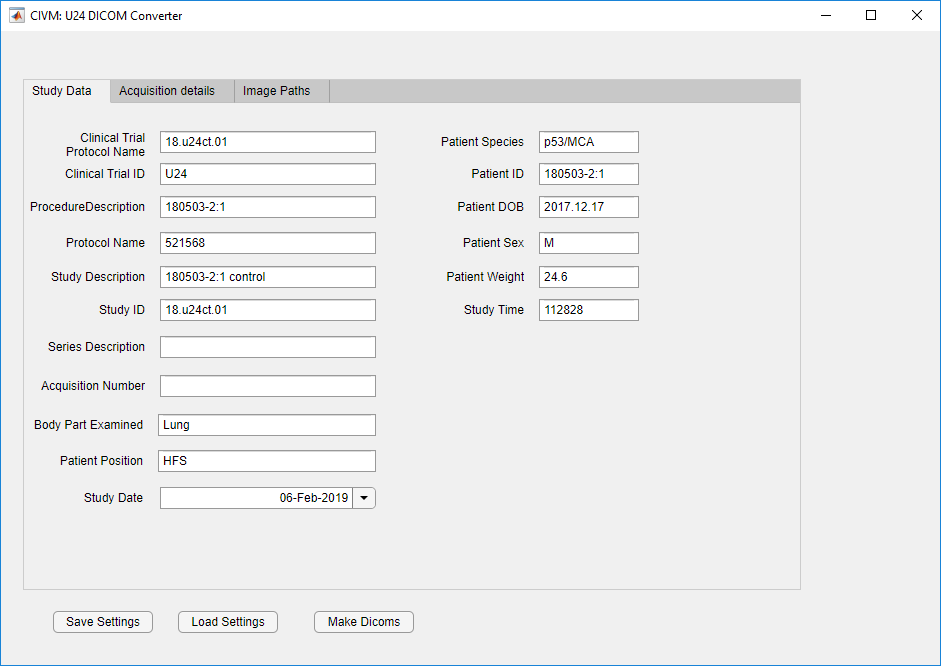
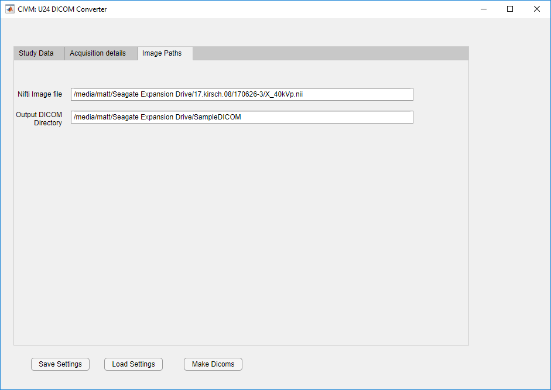

# U24 DICOM tool
### Matt Holbrook, Dr. Cristian Badea
### Center for In Vivo Microscopy, Duke University
This is a MATLAB-based tool for converting 3D image volumes from NifTi format to DICOMs. This repository contains a GUI which can be used to assign values to common DICOM fields. It also contains functions which can be used in your own code to streamline workflows.
This work is part of the [U24 co-clinical trial](https://sites.duke.edu/pcqiba/) of which [CIVM](http://www.civm.duhs.duke.edu/) at Duke University is a participant. This work has been funded by **NIH U24CA220245**.

## Dependencies
##### MATLAB
The GUI for this application is build using MATLAB's appDesigner. To run the GUI we recommend using **MATLAB 2018a** or later.
##### Libraries
We use both the [NifTi toolbox](https://www.mathworks.com/matlabcentral/fileexchange/8797-tools-for-nifti-and-analyze-image) and [Json Lab](https://github.com/fangq/jsonlab). These packages allow consistent handling of NifTi files across all our software and make JSON files easier to edit manually.

## GUI
The GUI can be launched by running `dicom_app_v1` in the MATLAB command line. This will launch the following window:

The GUI shows the most common DICOM fields which we use for our micro-CT acquisitions. The fields will auto-populate based on the latest field values. Match the formatting from the default fields to input new information. DICOM fields can also be saved and loaded using the `Save` and `Load` buttons which will help for saving DICOMs with largely different fields (eg. different imaging modalities, etc).
The most important fields to fill out are the `Image File` and `Output directory` fields, as these are the paths to the input NifTi file and output DICOM directory. The GUI will perform the conversion when the `Make DICOM` field is clicked.

## Functions
MATLAB functions for creating DICOM data is given, `write_dicoms.m` and `save_header.m`. These functions contain information on how they are to be used to work in a pipeline for DICOM conversion.
